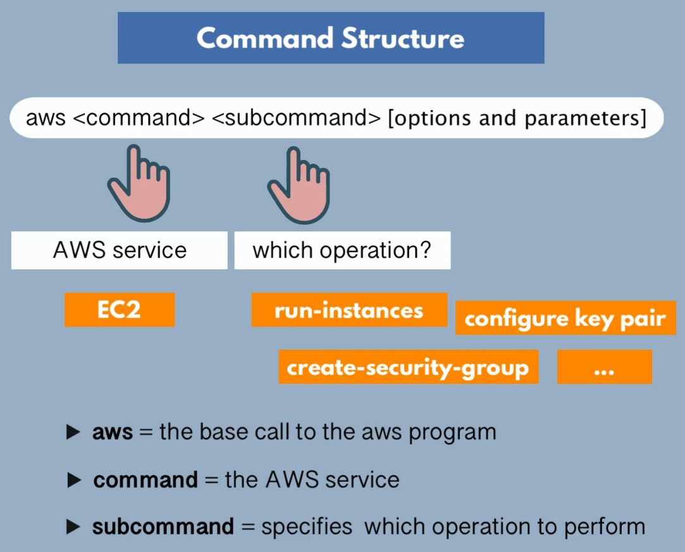

# AWS

AWS is an Infrastructure as a Service platform which allows you to configure your infrastructure in a very granular level.

## IAM (Identity and Access Management)

Manage access to AWS services and resources. We can decide using IAM who is allowed to use which services and resources. Can create and manage AWS users and groups. Assigns policies, set of permissions to user and groups.

By default Root user is created. Root user has all the privileges.

Creating an admin user with less privileges:

IAM user vs IAM roles

IAM users is assigned to human or system users who are using AWS to create services and configuring them and etc. Policies are assigned to user to give him access to that resource. 

But if a user wants to delegate his provisioning/configuring to other AWS services so that service can also create the EC2 instance, the service cannot be assigned polices just like user accounts. Instead we assign services a role and assign polices to that role. We have role for each service and policy is specific to service.

**Virtual Private Cloud(VPC)**:
VPC is your own isolated network in the cloud for each specific region. VPC spans all the AZ(subnet) in that region. VPC isolates the space where you are creating virtual instances servers, database instance etc. Private network isolated from others. **It is a virtual representation of network infrastructure**. Subnet spans each az, subnet for each az. There are *private* and *public* subnet in VPC.

When we create a vpc we get default subnets, and we cannot say we need a private subnet of public subnet. What actually happens is that we configure firewall rules for subnet that make it into a private or public subnet. Firewall rule configuration make it either into a private and/or public subnet. 

When we block all the communication from outside into a subnet its a private subnet but other services inside the VPC still have access to each other. e.g. we have an application in a public subnet and database in private subnet, Our application can talk to database running in private subnet because they are in same private network(VPC).

In VPC we have a range of private or internal private ip addresses. That range is define by default but we can still configure it with CIDR value. So whenever we create an instance then IP address is assigned to it from this range. Internal IPs are not for internet/outside traffic but for traffic inside the VPC, for communication inside the VPC eg. communication between multiple internal databases.

IP address range is defined on the VPC level then each subnet gets it own ip address range from that total range.

For allowing internet connectivity with your VPc you also have Internet Gateway. internet gateway connects the VPC to the outside internet.

We can configure access rule on a subnet level or individual instance level. To configure access control on subnet level is through **Network Access Control List(NACL)**. configure access on subnet level -> NACL, configure access on instance level -> Security Group.

**CIDR block**:
 CIDR block is a range of IP addresses.

 ---

 ## AWS CLI

`aws configure`



get all security groups: `aws ec2 describe-security-groups --region ap-south-1 --output yaml`

get all vpcs: `aws ec2 describe-vpcs`

create security groups: `aws ec2 create-security-group --group-name my-sq --description "my-sq" --vpc-id vpc-0328316a3365bc0`

get detail of a specific sg: `aws ec2 describe-security-groups --group-ids sg-07963fff325021`

add security group rules: `aws ec2 authorize-security-group-ingress --group-id sg-07963fff325021 --protocol tcp --port 22 --cidr my-ip/32` 32 to allow only 1 ip thats mine

create key-pair: `aws ec2 create-key-pair --key-name Mykpcli --query 'KeyMaterial' --output text > mykpcli.pem`

get subnets: `aws ec2 describe-subnets`


creating ec2 instance: 
```
aws ec2 run-instances \
> --image-id ami-008ad682ec6c1335b \
> --count 1 \
> --instance-type t2.micro \
> --key-name mykpcli \
> --security-group-ids sg-07963fff325021309 \
> --subnet-id subnet-0531416b7e85b010b
```

get instances: `aws ec2 describe-instances`

## filters and query

filter -> picks component
query -> picks specific attributes of components

`aws ec2 describe-instances --filters "Name=instance-type,Values=t2.micro" --query "Reservations[].Instances[].InstanceId"`

`aws ec2 describe-instances --filters "Name=tag:type,Values=web server with docker, more values, and more"`


