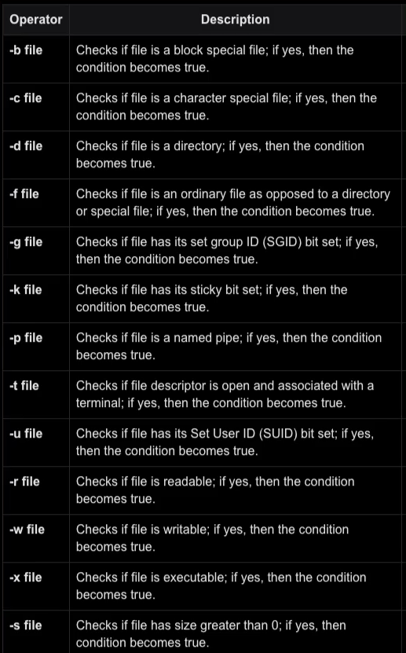
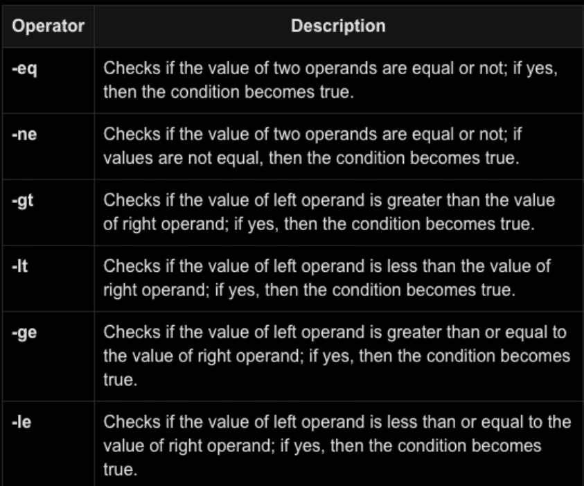
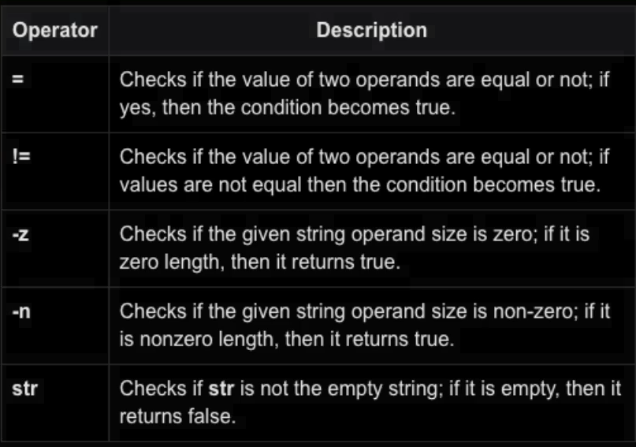

# OS

**Main tasks of OS**

* Resource Allocation and Management.
  * Process Management
  * Memory Management
  * Storage Management
* Manage File System
* Management of I/O devices
* Security and Networking

**Linux and MacOS both are POSIX compliant.**

Hypervisor is a technology that allows hosting multiple virtual computer on a physical computer.

With Virtualization we have our OS as a portable file that can be moved around. And this file is **Virtual Machine Image**. The VMI will include OS, applications everything that is required in this image.

## Package Manger

In linux we install most of the software using package manager tools.

**What is a Software Package?**
A software package is a compressed archive that contains all the required files by the software to run. Software applications usually have dependencies. SO these dependencies need to be installed.

**Package Manager.**

* Downloads, installs or updates existing software from a repository.
* Ensures the integrity and authenticity of the package.
* Manages and resolve all the dependencies.
* Knows where to put all the files in the Linux file system.

**Where does this packages come from?**
Where are all the packages and their dependencies stored?
Linux uses *Repository* to store thousands of softwares. Package managers get these files from the repositories.

We can also add a repository using `sudo add-apt-repository ''`. Some of these repositories we add to our system are **PPA(Personal Package Archive)** repositories. PPA allows application developers or private users to create their own repository for linux system and then distribute the software through that repository. PPAs are provided by community. Anybody can create PPA - private repository to distribute the software.

## User categories in Linux

1. Superuser Account
2. User Account
3. Service Account
Services (Apache, MySQL) gets their own user, they will not be started by a standard user or root user rather they will have a dedicated user(MySQL user or Apache user) that will start the application. This make sure each application is isolated in terms of permissions from each others and ensures better security. It is a best practice in Devops or server management to run services with their own dedicated user.

Add user: `sudo adduser username`
change user password: `sudo passwd username`
add group: `sudo groupadd groupname`
modify a user account: `usermod`

adduser, addgroup, deluser, delgroup are more interactive, more user friendly and easy to use modern commands. They should be used manually.
useradd, groupadd, userdel, groupdel are more low-level utilities and you need to provide the info yourself such as userId, groupId. They should be used more in scripts for automation.

changing user primary group: `usermod -g devops tom`

adding secondary  groups:
`sudo usermod -G admin, anotherGroup, more username` -> This -G option overwrites the whole secondary group list. It sets the new list for the user.
`sudo usermod -aG admin username` -> To append the group to the secondary group list.

add user to group while user creation: `sudo adduser -G devops username`
remove user from specific group: `sudo gpasswd  -d tom  devops`


**Changing file permissions**: `sudo chmod g=rw- tst.txt`

## Shell Scripting

All shell script files have the same .sh file extension. So how the os know which shell to use?
Using **Shebang** we tell the OS which shell to use to interpret the script. We write the shebang as the very first line of the script. `#!/bin/sh #!/bin/bash`. # is also called sharp in musical notation and ! also called band, therefore shebang.

**Variables**:

```bash
#!/bin/bash

echo "Setup and configure server"
file_name=config.yaml # variable, no space is allowed
config_files=$(ls config) # variable_name=$(command), Store output of a command in a variable.
echo "Using file $file_name to configure something"
echo "content of config folder: $config_files"
```

**Conditionals:**

```bash
#!/bin/bash

if [ -d "config" ]  # [...] builtin command, square brackets enclose expressions, -d config is a shorthand for test command (if test -d "config")
then 
  echo "reading config directory"
  config_files=$(ls config)
else
  echo "Config dir not found, creating one"
  mkdir config
fi

echo "Here are all the configuration files: $config_files"
```

-d is a **File Test Operators**, test various properties associated with a file.

`-e file Checks if file exists; is true even if file is a directory but exists`

**Relational Operators**, works only for numeric values.

`if [ $num_files -eq|lt 10 ]`

**String operators**:

`if [ "$user_group" == "devops" ]`  both '='(posix) or '=='(bash) will work.
`elif [ "$user_group" == "admin" ]` elif can also be used to check another condition.

**Passing arguments to the script.**
There are special variable $1-9
$* stores all the arguments that are passed to the script as a single string.
$# stores the total number of arguments provided.

**Read User Input**:

```bash
#!/bin/bash

echo "Reading user input."
read -p "Enter your password: " user_pwd
echo "password: $user_pwd"
```

**Loops**:
Types of loops:

* while loop
* for loop
* until loop
* select loop

for loop

```bash
for params in $* # equivalent to params-$* for each iteration
  do
    echo $params
  done
```

While loop

```bash
while [ condition ]
  do 
    echo
  done

sum=0
while true
  do
    read -p "Enter score: " score

    if [ "$score" == "q" ]
    then
      break
    fi

    sum=$(($sum+$score))
    echo "Sum is $sum"
  done
```

**Functions**:

```bash
function () {
  list_of_commands
}
function_name 

function total_sum {
  sum=0
  while true
  do
    read -p "Enter score: " score

    if [ "$score" == "q" ]
    then
      break
    fi

    sum=$(($sum+$score))
  done
}
total_sum # function call

function create_file() {
  file_name=$1
  is_script_file=$2
  touch $file_name
  echo "file $file_name created"

  if [ "$is_script_file" = true]
  then
    chmod u+x $file_name
    echo "added execute permission"
  fi
}
create_file test.txt
create_file config.yml

# using 5 parameters per function is too much.
```

**Returning values from the function**:
`$?` captures the value returned by last command.

```bash
function sum() {
  total=$(($1+$2))
  return $total
}

result=$(sum 1 2)
# or
sum 1 2
result=$?
echo $result
```

## Environment Variables

OS stores user related information in **Environment variables**. That are pieces of information defined by key value pairs.
By convention env variables names are all in UPPERCASE.

all env variables for a particular user: `printenv`
getting individual env variable: `printenv HOME`

env variables can also be referenced in bash scripts using `$USER`.

getting env variable in python
`os.getenv('USER') or  os.environ.get('SHELL')`

adding vars to env vars:
`export DB_USER=username` and rename the db value same way.

removing env vars:
`unset DB_USER`

Persisting env variables for a user:
adding `export DB_USER=username` to .bashrc | .zshrc then `source .bashrc` load the new env vars into the current shell session.

Persisting env vars system wide:
add vars in `/etc/environment` file.

adding our script to our path:
add in our user bashrc file `PATH=$PATH:/home/tmp`


## Networking

LAN - Local Area Network
Collection of devices connected together in one physical location.

Each device on the network is identified by a unique IP address. IP - Internet Protocol
Devices can communicate with other devices via these IP addresses.

IP - Internet Protocol

`172.16.0.0`
IP address is a 32 bit value where each bit is 1 or 0. Here every 8 bits are grouped into a octet and each octet can be represented as a decimal number. An octet of 8 zeros is 0 and octet of 8 ones is 255. So ip address can range from 0-255 (0.0.0.0 - 255.255.255.255).


How devices know other device IP address?
That is the task of a special device called switch. Switch sits within the LAN and knows all the IP address of all the devices therefore helps them communicating within the LAN.

How to connect to devices outside our LAN?
Router is a network device that sits between the LAN and outside networks(WAN). Router connects two different networks. **IP address of router is called Gateway (Network Gateway)**.

Subnet:
How does a device know whether a device is in LAN or is outside the LAN?
This is decided based on the IP address of the target device. The devices in LAN have IP addresses that belongs to same range of IP addresses to identify devices in same network. That IP address range is represented by concept called *Subnet*.

**Subnet**: Logical division of an IP network.
**Subnetting**: Process of division of network into two or more networks.

IP address range of LAN:
192.168.0.0 IP address - Starting point of IP range, the first IP in the range.
255.255.255.0 Subnet Mask - It defines whatever IP address of the device starts with 192.168.0.x it belongs to LAN.

Subnet mask dictates/tell us how many bits are fixed. 255.255.255.0 - means 24 bits are fixed, 255.255.0.0 - means 16 bits are fixed.

These is a shorthand way of writing this called **CIDR(Classless Inter-Domain Routing) block**
192.168.0.0/16 or 192.168.0.0/24

**IP addressed withing LAN are not visible to outside network or internet and these IPs are called Private IPs**.

When we send request to external server then our private IP is replaced by the router IP and this functionality of the router is called **NAT (Network Address Translation)**.

Benefits of NATS:

- Security and Protection of the devices within the LAN because our IP address are not directly exposed. 
- Reuse IP address, ranges without multiple times without conflicting with each other.

**Firewall**:
A system that prevents unauthorized access from entering a private network. Using firewall rules we can define, which requests are allowed.

**Ports**:
Every devices has a set of ports. Ports are like doors to same building. You can allow specific ports(doors) for request to enter and keep others locked. You can allow specific ports and specific IP addresses. Different applications listens on specific port and we can access the application on only that port. Each port is unique on device.

**DNS (Domain Name Service)**:
Every Computer on the internet is uniquely identified by its IP address. **Mapping of IP addresses to names**. The name is translated to the IP address of the server to which our computer can send request to. And the service that does this translation is DNS. **DNS translates domain names to IP addresses.

**Network commands**:
`ifconfig` - Information about you network.
`netstat` - Print network connections, routing tables, interface statistics. Shows active network connections, active connections means which applications are actively listening on their specific ports.
`nslookup` - query internet name servers. Get IP of domain name.
`ping`
